  <h3><code>HakanTavuz@github ~ $ ./contributions.sh</code></h3>
  
    
  <h3><code>HakanTavuz@github ~ $ whoami</code></h3>
  <table>
    <tr>
      <td valign="top"></td>
      <td valign="top"></td>
    </tr>
  </table>
  
Hakan · Developer · Builder

